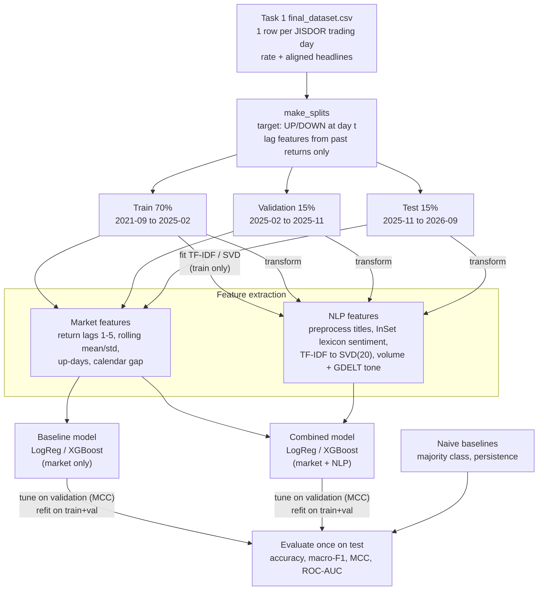

# Task 2 Report — outline

**Owner: Person C.** Turn this into the PDF (Google Docs / Word → Export as PDF). Aim for 3–5 pages. Each section says where its content comes from.

---

## 1. Task formulation

**Where the content comes from:** `src/config.py` (top comment), `src/evaluation/metrics.py` (docstring), `data/split_info.json`

- **Target.** Binary classification: will the Bank Indonesia JISDOR USD/IDR rate go **UP** (IDR weaker) or **DOWN** at trading day *t*, compared with *t−1*? Flat days (~1%) are dropped.
- **What the model knows at prediction time.** It predicts just before the 10:00 WIB fixing on day *t*. It has exchange-rate history up to *t−1*, plus all news published after fixing *t−1* and before fixing *t* (the alignment rule from Task 1).
- **Why binary instead of regression.** Direction is what matters for the hypothesis ("does news help predict the move?"). Daily return size is mostly noise, and classification metrics are easier to interpret.
- **Data split.** Chronological 70 / 15 / 15, with no shuffling. Give the date ranges and sizes from `split_info.json`, and explain why a random split would leak the future into training.
- **Metrics:**
  - **accuracy**, because it's intuitive
  - **macro-F1**, because the classes are imbalanced (~56% UP)
  - **MCC**, the main metric: 0 means no better than a constant guess
  - **ROC-AUC**

  Explain why accuracy alone is misleading: "always UP" already gets ~0.59 on test.
- **Protocol.** Tune on validation, refit on train+validation, then test exactly once.

## 2. NLP feature extraction: approach and justification

**Where the content comes from:** Person B's notes and `src/features/nlp_features.py`

- **Text source: headlines (titles).** They are available for all 5 years, while bodies exist only for 2024. They're short and dense with information, and GDELT already filtered them to economy and geopolitics themes. Mention the 91.9% title/body sentiment agreement from Task 1.
- **Preprocessing:** lowercasing, removing punctuation and digits, and Indonesian stopwords. Say why.
- **Lexicon sentiment with InSet** (Koto & Rahmaningtyas, 2017).
  - Why not VADER or Loughran-McDonald: they are English-only, and our news is in Indonesian.
  - The features computed.
  - Limitation: InSet was built for tweets, not financial news.
- **TF-IDF + TruncatedSVD.** It captures *what topics* are in the news (e.g. "the Fed", "oil", "war"), not just how positive or negative it is. SVD cuts ~5,000 words down to 20 dense features so the model doesn't overfit ~800 training days. Both are fitted **on train only**.
- **Basic features:** news volume, GDELT tone, and the share of weekend news.
- **Not used:** transformer and embedding models (FinBERT, IndoBERT, sentence-transformers), as required by the task.

## 3. Pipeline architecture diagram

A detailed diagram of the whole pipeline, from Task 1 data to evaluation. Draw it in draw.io / Excalidraw / Figma, or render the draft below at https://mermaid.live and polish it. Show clearly:

- which data goes to train, validation and test
- that TF-IDF/SVD are **fitted on train only**
- the two model branches (baseline vs. combined) sharing the same classifiers

## 4. Initial results

**Where the content comes from:** `results/results.md`, `notebook/02_results.ipynb`

- Paste the test table.
- Write 1–2 paragraphs answering: does the combined model beat the baseline? Does anything beat the naive baselines? Be honest; a weak or negative early result is fine and expected for daily FX.
- Next steps for Task 3.
